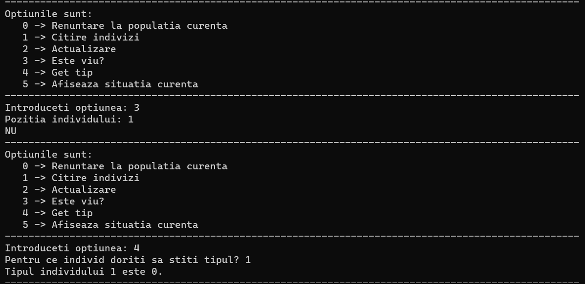

# population-game-oop
First project for OOP course. The focus of this project were the core principles of OOP, pointers and memory allocation. Learned the singleton design pattern by implementing it for the menu.

## Overview

    * Implemented using C++ and OOP principles
    * Used singleton design pattern for the interactive menu
    * Created simple game that simulates a population divided in two species that multiply, age and attack eachother until one of them is dominated by the other
    * The user can add new individuals and observe how the population evolves as time passes

## Screenshots

These are some demo photos of how the game works.

-> Starting the game, you get the menu with the following options: exit the game, input some individuals, update the population, check if individual is alive, see species of individual, see the population  
-> I entered 5 individuals and chose the option to generate their positions randomly

-> If i want to check some information about a non-existent individual, the game handles it with the message "INDIVIDUAL DOES NOT EXIST"  

-> Here is the population after this operation, the green individuals being the alive ones 

-> I chose to update the population, simulating that 1 unit of time passed and they had time to feed, multiply or attack eachother if they have neighbours of different species  

-> I updated the population with 50 units of time, to show how one population becomes dominant after some time (the red individuals are dead)  

-> After that, I tried the options that let me check if an individual is alive or show its species 

-> By updating the population with a lot of units of time, you can see that the population dies in the end, not having the space to continuously multiply  
-> The menu gives you the option to restart the game  

-> You can input the number of new sessions of game you want to play  

